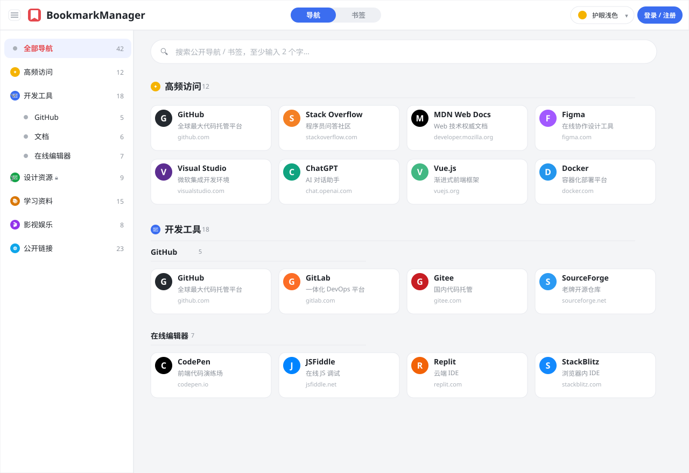
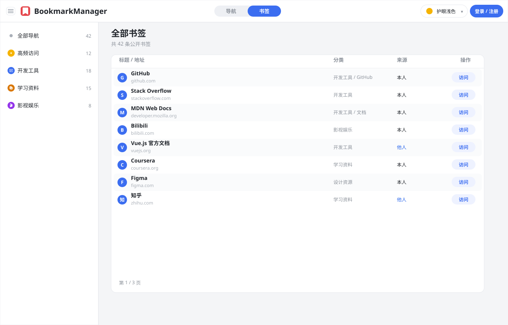
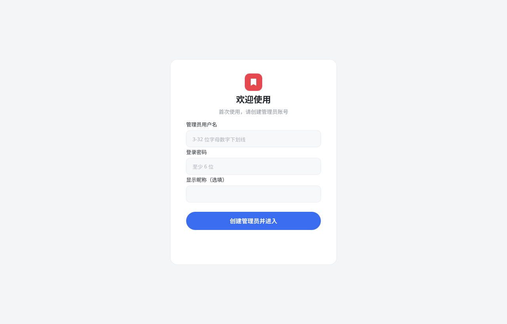
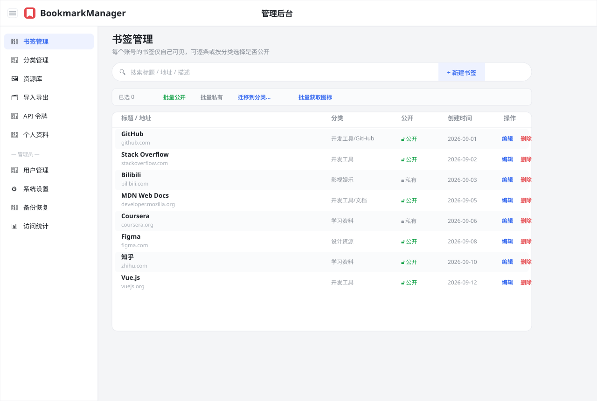
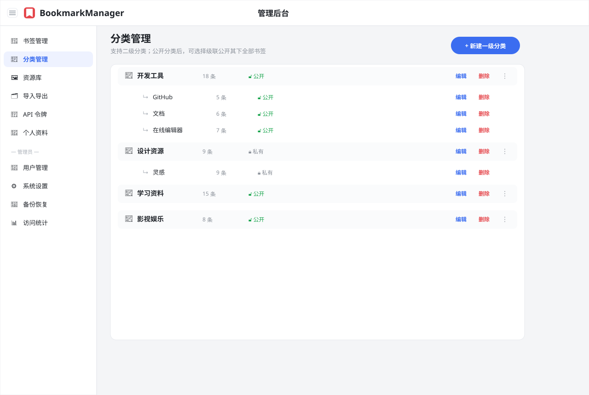
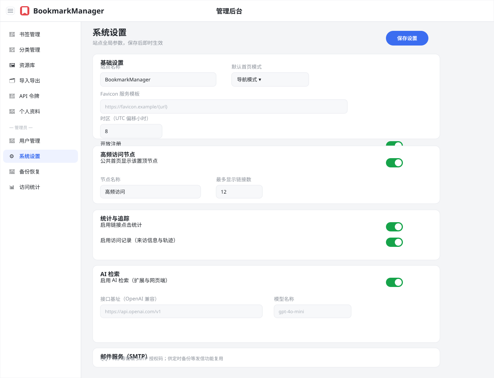
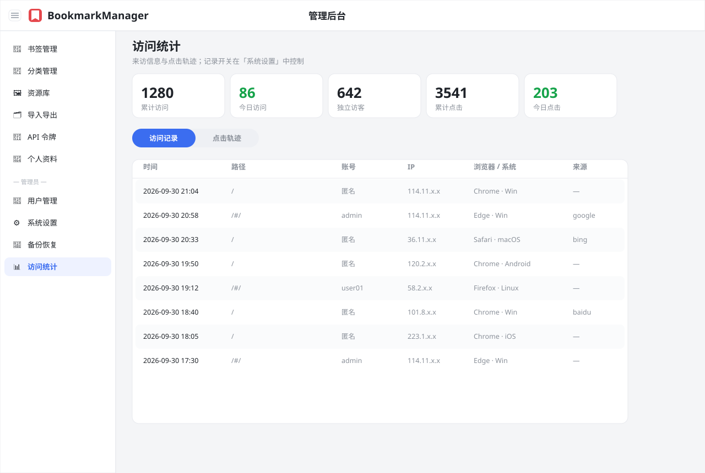
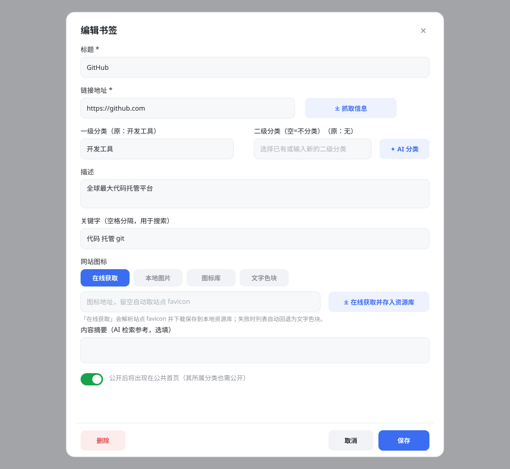
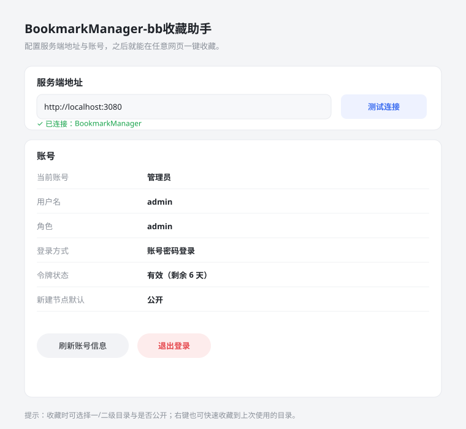
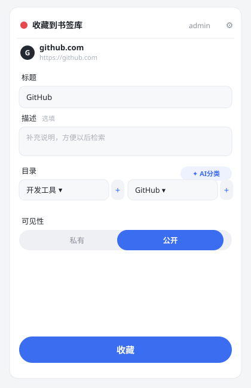

# BookmarkManager · 书签收藏助手 — 完整说明文档
这是一个ai生成的项目
> 一个自托管的**个人书签与导航管理平台**：支持多级分类、公开/私有、导航墙与书签表双视图、全文搜索、主题换肤、AI 智能分类、访问统计，并配套一键收藏的浏览器扩展。多用户数据互相隔离，单文件 SQLite，Docker 一键部署。<br>
> 本文件是**完整说明文档**，页面详解、书签编辑表单、浏览器扩展、系统设置等内容全部内联在这一个文件里，无需跳转。

---

## 功能特性

| 分类 | 能力 |
| --- | --- |
| **浏览** | 公共首页双视图：**导航模式**（分类卡片墙）/ **书签模式**（全量表格）；顶部一键切换 |
| **检索** | 模糊搜索（标题 / 地址 / 描述），输入 ≥2 字自动触发 |
| **分类** | 一/二级分类，支持折叠；可设公开 / 私有，公开可**级联公开**其下全部书签 |
| **高频节点** | 按点击量自动生成「高频访问」置顶节点，可自定义名称与数量 |
| **多用户** | 账号体系，每个用户数据互相隔离；管理员可管理全部账号、开关开放注册 |
| **图标** | 书签图标四种模式：在线 favicon / 本地图片 / 图标库（Iconify、selfh.st）/ 文字色块；分类节点图标：表情文字 / 本地图片 / 图标库 / 文字色块 |
| **浏览器扩展** | 官方扩展（Chrome / Edge）**一键收藏**当前页：弹窗收藏、右键快捷收藏、自动去重、可随时新建目录 |
| **批量操作** | 批量公开 / 私有、跨分类迁移、批量获取图标、书签拖拽排序 |
| **AI 能力** | 接入 OpenAI 兼容接口，自动为书签推荐一/二级分类；网页端 AI 检索（SSE 流式） |
| **主题** | 跟随系统 + 多套预设（浅色 / 护眼 / 薄荷 / 樱粉 / 石墨 / 深色 / 商务 …），偏好存账号 |
| **统计** | 访问记录、点击轨迹、累计/今日访问与点击；开关可控，可清空 |
| **数据** | 兼容 Chrome / Edge / Firefox 书签 HTML 导入导出，以及 JSON 批量；整库 / JSON 备份与恢复 |
| **开放生态** | API 令牌 + 开放 API（`/api/v1/*`），供浏览器扩展与第三方程序调用 |
| **工程** | 响应式布局，移动端抽屉式侧栏；后端 .NET 8，前端 Vue 3 无打包直出 |

---

## 界面与功能详解

> 以下截图为本项目还原的**界面预览图**（用示例数据填充），用于直观说明页面结构。实际部署后用浏览器打开即可看到真实效果。

### 1. 公共首页 · 导航模式



- 左侧分类侧栏：全部导航、高频访问、各一/二级分类（可展开折叠），分类后显示书签数量；🔒 表示私有分类（仅自己可见）。
- 顶部「🌐 公开链接」汇总**他人公开**的书签，登录后可见。
- 主区域按分类分块展示**卡片墙**：每张卡片含站点图标、标题、描述与域名；登录且是本人书签时，卡片右下角出现「编辑」按钮，可就地修改。
- 顶部右侧可切换「导航 / 书签」视图、切换主题、登录或进入后台。

### 2. 公共首页 · 书签模式



- 以全量表格呈现所有公开书签：标题/地址、归属分类、来源（本人 / 他人）、访问按钮。
- 适合需要快速检索、批量浏览的场景。

### 3. 登录 / 初始化 / 注册



- **首次部署**进入初始化向导：创建管理员账号（用户名 + 密码 + 可选昵称）。
- 已初始化后提供「登录 / 注册」双标签（注册开关由管理员在系统设置中控制）。
- 支持浏览器扩展通过账号密码或 API 令牌登录。

### 4. 后台 · 书签管理



- 本人书签的增删改查；支持按分类 / 公开状态筛选。
- 顶部工具条：搜索、新建书签、批量操作（**批量公开 / 私有**、**迁移到分类**、**批量获取图标**）。
- 列表内每行可编辑 / 删除；勾选多条后执行批量动作。
- 编辑表单（与公共首页的卡片编辑入口共用同一份）：详见下方「书签编辑表单详解」一节。

### 5. 后台 · 分类管理



- 一级 / 二级分类的树状管理，可拖拽排序（手柄拖动）。
- 每个分类可设公开 / 私有；公开分类可级联公开其下书签。
- 分类节点图标同样支持**表情文字 / 本地图片 / 图标库 / 文字色块**四种形态与自定义颜色。

### 6. 后台 · 系统设置



- **基础设置**：站点名称、默认首页模式、Favicon 服务模板、时区（UTC 偏移，即时生效）、开放注册、允许匿名访问公共首页、外网 IP 自动检测。
- **高频访问节点**：是否显示、节点名称、最多链接数。
- **统计与追踪**：链接点击统计、访问记录开关。
- **AI 检索**：启用开关、OpenAI 兼容接口基址 / Key / 模型。
- **邮件服务（SMTP）**：内置常用邮箱服务商快速填充，供定时备份等发信功能复用，支持发送测试邮件。

### 7. 后台 · 访问统计



- 概览卡片：累计访问、今日访问、独立访客、累计点击、今日点击。
- 分段切换「访问记录 / 点击轨迹」：时间、路径、访客、账号、IP、浏览器/系统、来源等明细，支持搜索与分页。

### 8. 其他后台页面

| 页面 | 说明 |
| --- | --- |
| **资源库** | 按账号隔离的图片资源（供书签 / 分类图标「本地上传」模式选用），可上传与管理 |
| **导入导出** | 兼容 Chrome / Edge / Firefox 书签 HTML，以及 JSON 全量数据批量导入导出 |
| **API 令牌** | 生成 `bmt_` 开头的长期令牌，供浏览器扩展与开放 API 调用；仅属于当前账号 |
| **个人资料** | 修改昵称 / 邮箱 / 头像、默认首页模式、主题与强调色、「新建默认公开」开关 |
| **用户管理**（仅管理员） | 账号列表、角色（管理员 / 普通用户）、启用停用、新建 / 编辑用户 |
| **备份恢复**（仅管理员） | JSON / 整库(.db) 备份下载与恢复；历史备份文件可「转换导入」自适应迁移旧版本数据 |

---

## 书签编辑表单详解



书签的**新建与编辑共用同一份表单**——公共首页卡片右下角的「编辑」入口，与后台「书签管理」的编辑，调用的都是它（`LinkForm`），因此字段与校验完全一致。

### 字段说明

| 字段 | 必填 | 说明 |
| --- | --- | --- |
| 标题 | ✅ | 书签显示名称 |
| 链接地址 | ✅ | 需以 `http(s)://` 开头；右侧「抓取信息」可自动读取目标网页的标题与描述 |
| 一级分类 | ✅ | 组合框：从下拉选已有，或直接输入新名称（**保存时自动创建**该分类） |
| 二级分类 | — | 选填；一级为空时禁用。同样支持选择或输入新建 |
| 描述 | — | 一句话说明，显示在卡片上 |
| 关键字 | — | 空格分隔，参与搜索匹配 |
| 网站图标 | — | 四种模式：在线获取 / 本地图片 / 图标库 / 文字色块（见下） |
| 内容摘要 | — | 选填，供 AI 检索参考 |
| 公开 | — | 开启后出现在公共首页（其所属分类也需公开） |

### 图标四种模式

| 模式 | 作用 |
| --- | --- |
| **在线获取** | 留空自动取站点 favicon；点「在线获取并存入资源库」会下载图标存入你账号的资源库，链接引用本地图片。站点无图标或下载失败时，列表自动回退为文字色块 |
| **本地图片** | 从资源库（图片分类）选择，或点「上传图片」新增；图片文件丢失时会提示并自动切到「文字色块」，避免「看着是色块、打开却在本地图片」的错位 |
| **图标库** | 打开 Iconify / selfh.st 双源图标库搜索，选中即下载入库并引用 |
| **文字色块** | 自定义图标文字（留空取标题首字）+ 强调色，实时预览；颜色留空时按标题生成一个稳定配色 |

### 智能与联动

- **AI 分类**：把链接地址发给后端 AI（OpenAI 兼容接口），返回的推荐名填入一级（`AI自动分类`）与二级分类框；仅在「系统设置 → AI 检索」启用时可用。
- **「抓取信息」只回填标题与描述**，不会自动改图标——图标需你手动选择。
- **分类按名落盘**：保存时若一级/二级名不存在会**自动新建**；新建分类的公开状态跟随当前书签（私有的一级分类下，二级会被后端强制为私有）。
- **保存校验**：标题非空、地址以 `http(s)://` 开头、一级分类非空。
- **删除**：编辑态左下角「删除」，二次确认后不可恢复。

### 图标库（Iconify / selfh.st）

- **Iconify**：单色矢量图标集，支持关键字搜索（如 `home` / `cloud` / `github`），可先用色块调色再选。
- **selfh.st**：彩色自托管应用图标，支持空词浏览与按应用名搜索（如 `jellyfin` / `docker`）。
- 选中时优先由浏览器直取（借力本机网络），失败自动改由服务端下载，最终统一存入资源库。

---

## 技术栈

- **后端**：.NET 8（Minimal API）+ Dapper + SQLite（WAL 模式）
- **前端**：Vue 3（全局构建，无打包流程）+ 原生 CSS，静态资源直出
- **部署**：Docker 多阶段构建；镜像内对前端 JS/CSS 做逐文件压缩，并剥离 .NET 调试符号以减小体积、避免源码泄露
- **数据**：单文件 SQLite，统一存放于挂载目录 `/data`（含运行配置 `app.json`、备份、日志、上传资源）

---

## 快速开始（Docker 部署）

### 前置要求

- 已安装 [Docker](https://www.docker.com/)（含 Docker Compose v2）
- 一个用于持久化数据的本地目录（镜像数据全部落在 `/data`）

### 方式一：`docker run`（最简单）

```bash
# 1) 拉取或自行构建镜像（见下方「自行构建」）
docker pull <你的镜像名>:latest        # 若已发布到镜像仓库
# 或在项目根目录（.net 目录，见下方说明）自行构建：
#   docker build -t bookmarkmanager:latest -f BookmarkManager/Dockerfile .

# 2) 运行，映射端口并把数据目录挂载出来
docker run -d --name bookmarkmanager \
  -p 3080:3080 \
  -v "$PWD/bm-data:/data" \
  bookmarkmanager:latest
```

- 访问：`http://localhost:3080`
- 数据落在宿主机的 `./bm-data`，删除容器不会丢失数据。

### 方式二：`docker compose`

在项目根目录（含 `docker-compose.yml`）创建并运行：

```bash
docker compose up -d
```

> 仓库内置的 `docker-compose.yml` 已配置好构建上下文。若需要固定端口与数据卷，可叠加一份 `docker-compose.override.yml`：

```yaml
services:
  bookmarkmanager.server:
    ports:
      - "3080:3080"
    volumes:
      - ./bm-data:/data
```

### 自行构建（构建上下文必须是上级 `.net` 目录）

本项目通过 `ProjectReference` 引用同级的 `Utils/` 源码，因此**必须在 `.net` 目录**执行构建（而非 `BookmarkManager/` 目录）：

```bash
cd <仓库根>/..        # 即包含 BookmarkManager/ 与 Utils/ 的 .net 目录
docker build -t bookmarkmanager:latest -f BookmarkManager/Dockerfile .
```

### 访问与初始化

1. 浏览器打开 `http://<服务器IP>:3080`。
2. 首次访问会自动进入**初始化向导**，创建管理员账号。
3. 登录后即可在「管理后台」配置站点、添加分类与书签。
4. 普通用户如需自助注册，请在「系统设置 → 基础设置」开启**开放注册**。

### 反向代理 / 自定义端口

- 改端口：把 `-p 8080:3080` 中的宿主端口 `8080` 改为你需要的端口（容器内固定为 `3080`）。
- 置于 Nginx / Caddy 等反代后，请将请求原样转发到容器 `3080`，并在反代层终止 HTTPS；应用读取 `config/app.json` 中的站点名等配置。

---

## 浏览器扩展（详解）

`extension/` 目录是一个 Manifest V3 扩展（Chrome / Edge，最低 Chrome 102），把当前页面**一键收藏**到你的 BookmarkManager 账号。

### 安装

1. Chrome 打开 `chrome://extensions/`（Edge 为 `edge://extensions/`）
2. 右上角打开「开发者模式」
3. 点「加载已解压的扩展程序」，选择本仓库的 `extension/` 目录
4. 建议把扩展固定到工具栏

### 设置（连接你的书签库）



在扩展设置页（首次点图标会自动引导打开）填写两项：

- **服务端地址**：如 `http://localhost:3080`，点「测试连接」可验证（会显示站点名称）。
- **账号**：两种方式任选：

  | 方式 | 说明 |
  | --- | --- |
  | 账号密码登录 | 用书签库账号密码登录；会话令牌 **7 天**有效，过期后重新登录即可 |
  | API 令牌 | 在后台「API 令牌」生成 `bmt_` 开头的令牌，**长期有效**，适合长期使用 |

设置页会显示当前账号、用户名、角色、登录方式、令牌状态，以及账号的「新建节点默认」偏好。

### 一键收藏



点扩展图标弹出收藏面板：

- **预览**：显示当前页域名与地址
- **标题 / 描述**：标题取当前标签页，描述尝试读取页面 meta description，均可修改
- **目录**：下拉选择一级 / 二级目录；右侧 `+` 可直接**新建目录**（无需切回后台）；「AI分类」可按页面地址让 AI 推荐
- **可见性**：私有 / 公开，首次会按账号的「新建节点默认」预选
- **收藏**：保存后显示结果页（保存到的目录与公开状态）

### 右键快捷收藏

在任意网页右键 →「**收藏本页到书签库**」；或在链接上右键 →「**收藏此链接到书签库**」。它会用**上次在弹窗里选择的目录与可见性**直接保存到后台，不打断当前浏览。

- 结果通过**工具栏角标**（绿=已存 / 灰=已存在 / 红=失败或登录失效）与**系统通知**反馈
- 通知里会显示保存到的「一级 / 二级」目录

### 自动去重与可见性规则

- **自动去重**：地址已收藏过会明确提示，不会重复写入。
- **私有目录优先**：若所选目录（或其上级）本身是私有的，即便选了「公开」，后端也会按私有保存，弹窗与通知都会提示。

### 依赖的服务端接口

| 接口 | 用途 |
| --- | --- |
| `POST /api/login` | 账号密码换取会话令牌 |
| `GET /api/auth/me` | 校验令牌并读取账号信息 |
| `GET /api/init_status` | 设置页连接自检 |
| `GET /api/ai_status` | 判断「AI分类」按钮是否可用 |
| `POST /api/tools/ai-classify` | AI 推荐目录 |
| `GET /api/v1/categories` | 读取分类树 |
| `POST /api/categories` | 新建目录 |
| `POST /api/v1/add_link` | 收藏页面，返回 `{ id, created, isPublic, url }` |

全部走 `Authorization: Bearer <token>`，`bmt_` 令牌与 JWT 均支持。扩展源码结构见 `extension/` 目录下的 `README.md`。

---

## 系统设置说明

| 设置组 | 关键项 | 说明 |
| --- | --- | --- |
| 基础设置 | 站点名称 | 显示在顶栏与浏览器标题 |
| | 默认首页模式 | 新访客首屏为「导航」或「书签」 |
| | Favicon 服务模板 | 留空取站点 `/favicon.ico`，或用 `{url}` 占位符接入公共图标服务 |
| | 时区（UTC 偏移） | 影响备份/日志/统计的本地时间显示，改后即时生效 |
| | 开放注册 | 是否允许访客自助注册 |
| | 允许匿名访问公共首页 | 关闭后公共首页仅登录可见 |
| 高频访问节点 | 显示 / 名称 / 数量 | 按点击量取前 N 条置顶 |
| 统计与追踪 | 点击统计 / 访问记录 | 关闭后停止写入新数据（旧数据保留） |
| AI 检索 | 启用 / 基址 / Key / 模型 | OpenAI 兼容接口，驱动自动分类与网页端检索 |
| 邮件服务 | SMTP | 内置 QQ/163/GMail 等服务商快速填充，供发信功能复用 |

---

## 目录结构

```
BookmarkManager/
├── src/BookmarkManager.Server/   # .NET 8 后端 + 前端静态资源(wwwroot)
│   ├── wwwroot/                  # 前端：index.html + assets/*.js + app.css
│   └── Dockerfile                # 多阶段构建（含前端压缩、符号剥离）
├── extension/                    # 浏览器扩展（MV3）+ 扩展说明 README
├── docs/                         # 项目文档
│   ├── README.md                 # 完整说明文档（本文件）
│   └── images/                   # 各页面界面预览图（SVG）
├── config/                       # 本地开发配置（app.json 模板）
├── data/                         # 本地开发数据（SQLite / 备份 / 资源）
├── tools/                        # 辅助脚本（含文档预览图生成脚本）
├── docker-compose.yml            # 容器编排（构建上下文）
├── Dockerfile                    # 根 Dockerfile（同 src 下，构建上下文说明）
└── README.md                     # 精简入口（简介 + 快速开始 + 文档导航）
```

> 容器内所有运行时数据（SQLite 库、配置、备份、日志、上传资源）统一位于 `/data`，只需挂载这一目录即可整体持久化。

---

## 常见问题

**Q：端口 3080 被占用？**
改宿主机映射端口即可，例如 `-p 8080:3080`；容器内部固定为 `3080`。

**Q：数据存在哪里？如何备份？**
全部在挂载的 `/data` 目录（或本地 `data/`）。也可在后台「备份恢复」中下载 JSON / 整库(.db) 备份。

**Q：忘记管理员密码？**
以管理员身份在「用户管理」中重置该账号密码；或停止服务后直接操作 `/data` 下的 SQLite（需谨慎）。

**Q：国内拉取基础镜像慢？**
可改用国内镜像源（如 `mcr.microsoft.com` 的阿里云 / 腾讯云加速），或在 `Dockerfile` 中把 `node:20-alpine` 的安装步骤替换为国内 npm 镜像（`--registry=https://registry.npmmirror.com`）。

**Q：公开链接 / 他人书签为什么看不到？**
「🌐 公开链接」节点仅在**登录**且系统开启公共浏览时显示；某条书签要出现在公共首页，需其**自身公开**且**所属分类公开**。

**Q：图标为什么不显示？**
在线 favicon 抓取失败的链接会自动回退为文字色块；本地上传的图标若被删除，列表同样回退为文字色块（编辑表单会提示）。

---
qq群：1125582506

## 许可证

本项目供个人自托管使用。如需在更大范围分发或商用，请查看仓库中的许可证文件（或自行补充 `LICENSE`）。
